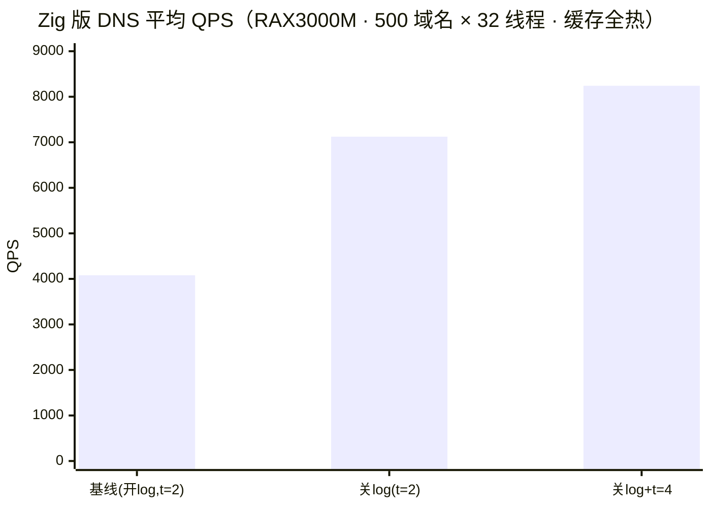

# zig-dnsmasq

把 [dnsmasq 2.93](https://thekelleys.org.uk/dnsmasq/doc.html) 的 **DNS 解析 / 转发** 部分与
[odhcpd](https://git.openwrt.org/?p=project/odhcpd.git) 的 **DHCPv4 / DHCPv6 / RA / NDP** 部分，
用 **Zig 0.16** 重新实现为一个可在 OpenWrt 路由器（aarch64-musl，ujail 沙箱）上运行的单二进制，
用于替换系统自带的 dnsmasq 与 odhcpd。

> 根据 odhcpd 和 dnsmasq 重写。
> 每个源文件顶部都标注了对应的上游 C 源文件（`dnsmasq.c:NNNN` / `dhcpv4.c:NNNN` / `odhcpd.c:NNNN`），
> 实现时逐条对照上游行为，以保证功能与配置兼容性。

---

## 一、许可证（License）

**GPL-2.0-only**（见 `LICENSE`）。

本项目是 dnsmasq 与 odhcpd 的移植 / 翻译，属于二者的**派生作品**，因此**不能**采用 MIT 等宽松许可证：

| 来源 | 版权 | 许可证 |
| --- | --- | --- |
| dnsmasq 2.93 | Copyright (c) 2000-2026 Simon Kelley | GPL-2.0-or-later |
| odhcpd | Copyright (C) 2012-2013 Steven Barth / OpenWrt | **GPL-2.0-only** |

odhcpd 是 GPL-2.0-**only**（不含 "or later"），这决定了整个作品只能以 **GPL-2.0-only** 发布
—— 不能选 GPLv3-only，更不能 MIT。发布时请保留 `LICENSE` 与每个源文件顶部的版权 / 许可证声明，
并随发行提供对应源码。

---

## 二、功能概览

| 能力 | 状态 | 说明 |
| --- | --- | --- |
| DNS 缓存（LRU、负缓存、SOA 判定） | ✅ 已验证 | 对照 C 版逐字段 A/B |
| DNS 转发（UDP/TCP、异步事件循环、多上游负载均衡） | ✅ 已验证 | 扩展了动态负载均衡 |
| 配置解析（dnsmasq 选项子集） | ✅ 已验证 | 见下方「已生效选项」 |
| DHCPv4（地址分配、租约文件、静态绑定、ARP 注入） | ✅ 已验证 | 真机冷启动验证通过 |
| DHCPv6 / RA / NDP（SLAAC、RDNSS、PD） | ✅ 已验证 | 对齐 odhcpd |
| 单二进制双身份（dnsmasq + odhcpd） | ✅ 已验证 | busybox 式多合一，按 `argv[0]` 分派 |

**已生效的 dnsmasq 选项**（方括号内为对应 C 选项）：`port` `cache-size` `dns-forward-max`
`edns-packet-max` `threads` `interface` `except-interface` `listen-address` `resolv-file`
`all-servers` `strict-order` `domain` `local` `address` `server` `expand-hosts` `no-hosts`
`addn-hosts` `domain-needed` `bogus-priv` `stop-dns-rebind` `rebind-localhost-ok` `local-ttl`
`neg-ttl` `max-ttl` `max-cache-ttl` `min-cache-ttl` `use-stale-cache` `log-queries` `log-facility`
`pid-file` `no-daemon` `keep-in-foreground` `conf-file` `conf-dir` `bind-interfaces` `bind-dynamic`。

---

## 三、性能表现（DNS 解析）

在 **RAX3000M**（2 核 ARMv8，aarch64-musl）上，用 `stress500.py`、500 域名 × 32 线程、缓存全热，
对比 Zig 版在不同配置下的表现。最大瓶颈是「每查询一条 syslog 日志」—— 关掉 `log-queries`
并开 `threads=4` 即可把吞吐**翻倍**。

```mermaid
xychart-beta
    title "P95 / P99 延迟（ms，越低越好）"
    x-axis ["基线(开log,t=2)", "关log(t=2)", "关log+t=4"]
    y-axis "ms" 0 --> 60
    bar [32.4, 12.9, 13.7]
    bar [53.6, 18.3, 19.6]
```





| 配置 | 平均 QPS | p50 | p95 | p99 | CPU | 单查询成本 |
| --- | --- | --- | --- | --- | --- | --- |
| 基线（log-queries 开，threads=2） | 4081 | 1.56ms | 32.4ms | 53.6ms | 66.7% | 158 µs |
| 关 log-queries | 7123（+75%） | 1.56ms | 12.9ms | 18.3ms | 112.8% | 121 µs |
| 关 log-queries + threads=4 | **8242（+102%）** | 1.28ms | 13.7ms | 19.6ms | 110.8% | **103 µs** |

要点：

- **最大性能杀手是每查询一条 syslog 日志**（占单查询成本 ~37µs，且同步写 `/dev/log` 串行化吞吐）。
  日常关掉 `log-queries`，排查时再临时开（`uci set zig-dnsmasq.main.logqueries='1'`）。
- **`threads=4`** 在 2 核机上仍有 +15%（核间流水 / 等待错开），内存代价约 0.5MB。
- **`dns-forward-max=150` 偏小**：冷缓存暴发（500 个新域名同时查）会打满触发 SERVFAIL，建议 500~1000。
- 设计与 C 版逐字段 A/B；性能以「**单查询 CPU**」（`/proc` tick 增量 ÷ 查询数）为稳定指标
  （同机同份二进制两次 QPS 可差 4%+，优先看单查询成本而非 QPS）。
- 完整优化分析见 `性能优化分析.md`，压测复现见该文末「复现」。

---

## 四、构建

需要 Zig 0.16（本项目用 `/opt/zig/zig`）。

```bash
# 本地单元测试
zig build test

# 交叉编译到路由器（aarch64-musl）
zig build -Dtarget=aarch64-linux-musl -Doptimize=ReleaseFast --prefix zig-out-arm
llvm-strip zig-out-arm/bin/zig-dnsmasq
```

产物：`zig-out-arm/bin/zig-dnsmasq`（单二进制，同时充当 DNS 与 DHCP 服务器）。

---

## 五、使用说明

### 5.1 作为 DNS 服务器（默认身份）

直接像 dnsmasq 一样用，读 `/etc/dnsmasq.conf` 或命令行：

```bash
# 前台运行、监听 53、读默认配置
./zig-out/bin/zig-dnsmasq --no-daemon

# 指定上游、缓存大小、网卡
./zig-out/bin/zig-dnsmasq \
    --server=223.5.5.5 --server=8.8.8.8 \
    --cache-size=10000 --interface=br-lan --no-daemon
```

以 `dnsmasq` 身份启动时，按 dnsmasq 的命令行 / 配置文件语义工作（DNS 转发 + 缓存）。

### 5.2 作为 DHCP 服务器（odhcpd 身份，多合一二进制）

照抄 busybox 的**多合一二进制**：按 `argv[0]` 认身份，安装只需一条软链接。

```bash
# 让 /usr/sbin/odhcpd 指向我们的二进制，之后 odhcpd 就是 DHCP 服务器
ln -sf /usr/bin/zig-dnsmasq /usr/sbin/odhcpd
```

两种配置来源（**自动判断**，判据是「有没有出现配置类参数」，不是参数个数）：

| 调用方式 | 配置来源 | 语义 |
| --- | --- | --- |
| `odhcpd`（无参数 / 仅 `-k` `--log-dhcp` `--interface` `--pid-file` 等通用开关） | `/etc/config/dhcp` | **odhcpd 风格（UCI）** |
| `odhcpd --dhcp-range=…` / `--dhcp-host=…` / `--dhcp-option=…` / `--conf-file=…` | 命令行 | **dnsmasq 风格（不读 UCI）** |

```bash
# odhcpd 风格：直接读 /etc/config/dhcp（逻辑接口名 lan → 经 netifd 状态解析成 br-lan）
/tmp/odhcpd --test

# 指到别的 UCI 路径（测试用）
/tmp/odhcpd --uci-file=/tmp/t/dhcp --uci-network=/etc/config/network \
            --uci-state=/var/state/network --test

# dnsmasq 风格：强制只认命令行
/tmp/odhcpd --no-uci \
    --dhcp-range=192.168.9.100,192.168.9.200,255.255.255.0,12h \
    --dhcp-host=aa:bb:cc:dd:ee:ff,192.168.9.5,nas \
    --interface=br-lan --test
```

UCI 侧读懂的字段：全局 `config odhcpd` 的 `maindhcp` / `leasefile` / `hostsdir` / `leasetrigger`；
`config dhcp` 的 `interface`(`ifname`/`networkid`) / `start` / `limit` / `leasetime` / `dhcpv4` /
`list router` / `list dns` / `list domain`；`config host` 的 `ip` / `list mac` / `name` / `leasetime`。
语义逐条对齐 odhcpd（含 `maindhcp=0` 时不做 v4、池为相对网段基址的偏移、`config host` 的 `name`
优先于客户端自报 option 12 等）。

### 5.3 部署到 OpenWrt 路由器

`openwrt/` 目录含 init 脚本、UCI 默认值与安装脚本。要点：

1. 部署 = `stop → 覆盖二进制 → start`，且必须核对三件事：
   - overlay 上的 md5 与本地一致；
   - `readlink /proc/<pid>/exe` **无 `(deleted)`**（否则旧进程仍在跑旧 inode）；
   - 端口重新绑上（`:53` / `:67` / `:547`）。
2. **单二进制接管两个服务 → 必须 restart 两个 init**：`/etc/init.d/zig-dnsmasq` 只管 DNS，
   odhcpd 由 `/etc/init.d/odhcpd` 经 procd 独立监督。只更新一头，另一头会继续跑旧 inode。
3. 回退官方 odhcpd：`rm /usr/sbin/odhcpd`（删掉软链接，露出 ROM 里的官方二进制）再 `restart`。

```bash
# 一键安装到路由器（见 openwrt/install.sh）
sh openwrt/install.sh <router-ip>
```

### 5.4 安全自测（回环，不碰物理网卡）

在**生产网段**里起 DHCP 服务器会与上游 DHCP 抢答，因此本项目用回环密闭法自测：
把地址池放进 `127.0.0.0/8`，客户端从 `127.0.0.2` 发包给 `127.0.0.1:67`，全程只在回环里交付。

```bash
# 回环自检：起服务端 → 发 DISCOVER/REQUEST → 校验 OFFER/ACK/租约文件
./zig-out/bin/zig-dnsmasq --applet=odhcpd --no-uci --zd-selftest \
    --zd-port=6767 --zd-client-port=6868        # 无特权端口时用这两个开关

# UCI 风格也走同一条自检：池整段在 127.0.0.0/8 内就直接用，否则拒绝（退出码 2）
./zig-out/bin/zig-dnsmasq --applet=odhcpd --zd-selftest \
    --uci-file=/tmp/t/dhcp --uci-network=/tmp/t/network --uci-state=/tmp/t/state

# 本机握手回归（含 hosts/状态文件内容、静态绑定、畸形报文）
python3 e2e/dhcp_local_test.py ./zig-out/bin/zig-dnsmasq
```

在路由器上跑自检时再加 `--interface=lo`：`SO_BINDTODEVICE` 会把局域网进来的报文挡在门外，
进一步保证不与上游 DHCP 互相干扰。

---

## 六、已完成

- DNS：配置解析、UDP/TCP 服务、异步转发引擎、多上游动态负载均衡、缓存（LRU / 负缓存 / SOA 判定）、
  报文解析与应答构造、域名 / 服务器匹配、hosts 读取、resolv.conf 轮询、日志。
- DHCPv4：报文编解码与地址分配（纯逻辑）、保留地址排他、租约文件读写、静态绑定、ARP 注入、
  接口就绪前的门控与就绪后重读 UCI（解决冷启动「0 池」）、SIGHUP 平滑 reload。
- DHCPv6 / RA / NDP：RA 默认路由自动检测、RDNSS 通告本接口全局地址（含 ULA 优先、链路本地兜底）、
  IA_NA 分配写入 odhcpd 状态文件、前缀跟随 netlink 事件触发。
- DNS 应答记录轮转（round-robin，默认开，`--no-round-robin` 关闭）；
  缓存插入按 (名字, 地址族, 地址) **整组替换**（复刻 C `cache_scan_free` + `new_chain` 批处理语义）；
  `--rebind-domain-ok=` 按域名豁免 rebind 检查；`--alias=`（doctor）按掩码改写上游 A 记录并清 AA。
- SRV / PTR 的正向 RR 缓存（对应 C `F_RR`）：RDATA 去压缩、重编码后入库，命中后原样回放；
  `--localise-queries` 按「查询到达的地址」过滤 hosts 记录（多网段主机名只回同网段地址）；
  TCP 跨报文 DNS 消息重组（长度前缀与正文各自读满，等价 C `read_write()` 语义）。
- 单二进制双身份 + 单实例闸门；启动状态落盘自检（`/tmp/odhcpd-boot.txt`）。

对照基线：C 版 dnsmasq 2.93 与 odhcpd 上游 HEAD 同时在路由器上跑，逐字段 A/B 比对；
一键本地回归 `e2e/run_all.sh`，路由器侧 A/B `e2e/run_router_suite.sh`。

---

## 七、未完成项目（TODO）

按对「纯 DNS 转发 / 缓存」与 DHCP 场景的影响分级。

### 影响高：已全部完成

原本的 5 项（`--localise-queries`、应答记录轮转、源地址选择、缓存插入去重、SRV/PTR 正向缓存）
均已实现并逐字段 A/B 对照通过，见上一章节。

> 关于「IP_PKTINFO 源地址选择」：本移植刻意**不做通配绑定**（每个具体地址一个 socket），
> 因此「查询到达的目的地址」必然等于监听 socket 的绑定地址 —— 这与 IP_PKTINFO 的
> `ipi_addr` 等价，而**回包也走同一个已绑定 socket**，源地址天然就是该地址（正是
> IP_PKTINFO 源地址选择要达到的效果），所以无需 `recvmsg`/cmsg。仅当显式通配绑定
> （无 `--listen-address`/`--interface`）时目的地址不可知，此时 `--localise-queries`
> 会**明确告警**并失效，而不会悄悄按错误网段过滤。

### 影响中：还剩 1 项

1. **本地静态 RR 选项 —— 识别后 warning + 忽略**
   `host-record` `cname` `txt-record` `mx-host` `srv-host` `ptr-record` `naptr-record`
   `interface-name` `caa-record` `dns-rr` `rev-server` `synth-domain` `localmx` `selfmx`。
   这 14 个选项共用一个「本地静态记录」子系统（C 侧是 `daemon->mxnames` / `daemon->txt` /
   `daemon->ptr` / `host_record` 等一批结构 + 各自的应答分支）。本移植**尚未移植**，
   目前统一 warning + 忽略；配套地 `checkForLocalDomain()` 只查缓存。
   （TCP 分片重组、SRV/PTR 缓存、localise-queries 均已完成，不再列入。）

### 影响低：与纯 DNS 转发无关的大子系统（本阶段不做）

- DHCP 侧的 `dhcp6.c` / `rfc2131.c` / `rfc3315.c` / `radv.c` / `slaac.c` / `lease.c`
  中尚未完整覆盖的边界场景（部分对照项见 `DHCP-PLAN.md`）。
- `dnssec.c` / `crypto.c` / `rrfilter.c`（DNSSEC）、`auth.c`（权威区）、
  `tftp.c`、`ipset.c` / `nftset.c` / `conntrack.c` / `bpf.c`（xtables/nftables）、
  `dbus.c` / `ubus.c`、`inotify.c`、`loop.c`（`--dns-loop-detect`）、`metrics.c` 等。
- TXT/MX 两边都不缓存（与 C 一致，**不是**缺口）。

完整的「识别但忽略」选项清单见 `src/options.zig` 的 `known_unimplemented`：这些选项只打 warning
不报错，因此把发行版生成的 `dnsmasq.conf` 直接喂进来不会导致进程退出。

---

## 八、目录结构

```
zig-dnsmasq/
├── src/             # 全部 Zig 源码（每个文件顶部标注对应的上游 C 文件）
│   ├── main.zig          # 入口（DNS 模式）
│   ├── odhcpd_main.zig   # 入口（DHCP/odhcpd 模式）
│   ├── forward.zig / fwdengine.zig   # DNS 转发 / 异步引擎
│   ├── cache.zig / rfc1035.zig       # 缓存 / 报文编解码
│   ├── dhcpv4.zig / dhcpv6.zig / router.zig / v6rt.zig / v6conf.zig  # DHCP/RA/NDP
│   ├── uci.zig / uci_dhcp.zig        # OpenWrt UCI 解析
│   └── ...
├── e2e/            # 端到端测试与探针（rs_probe.zig / v6probe.zig 等）
├── openwrt/        # 路由器部署：init 脚本、UCI 默认、install.sh
├── tools/          # 本地测试辅助脚本
├── bench/          # 性能压测工具（含 dnsbench 源码）
├── docs/           # 对照文档（上游 odhcpd 对照、DHCP 计划等）
├── 性能优化分析.md  # DNS 性能压测与优化分析
├── build.zig / build.zig.zon
├── LICENSE         # GPL-2.0 全文
└── README.md
```

---

## 九、上游对照与致谢

- 实现以 **dnsmasq 2.93**（Simon Kelley，GPL-2.0-or-later）与 **odhcpd**（Steven Barth / OpenWrt，
  GPL-2.0-only）为基线，逐函数对照移植，行为以在两台路由器上同时跑、逐字段 A/B 比对为准。
- 本作品整体以 **GPL-2.0-only** 发布，详情见 `LICENSE`。
